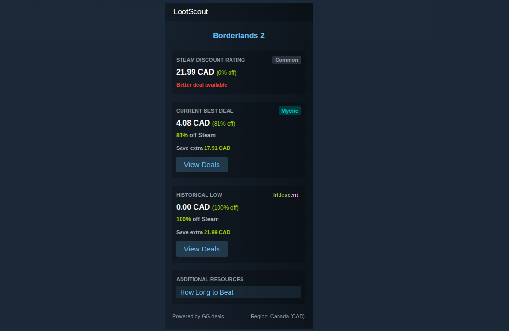
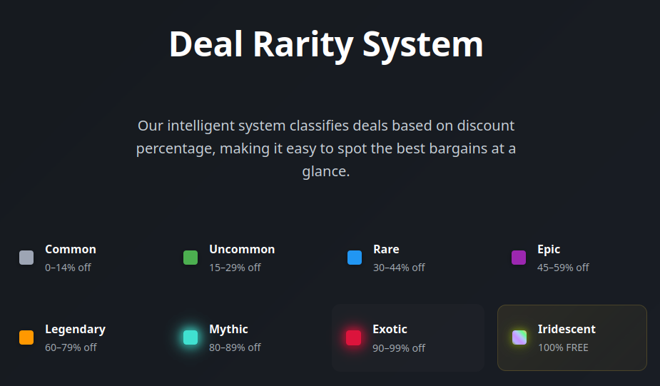
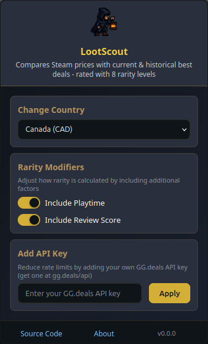
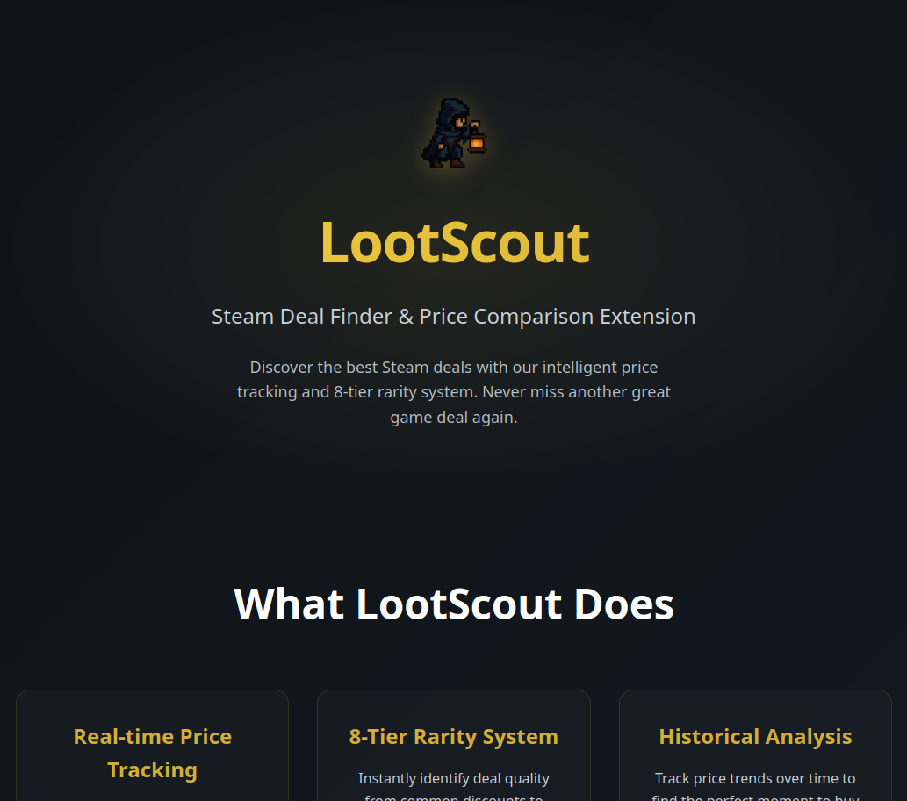

<div align="center">
  
  <h1>LootScout</h1>
</div>

A browser extension that enhances your Steam browsing experience by providing real-time game deal information and pricing comparisons directly on Steam store pages. Data is sourced from Steam's official API and GG.deals to ensure accurate, up-to-date pricing across multiple platforms.

## Table of Contents

- [Download](#download)
- [Features](#features)
- [Screenshots](#screenshots)
- [How It Works](#how-it-works)
- [Deal Rarity System](#deal-rarity-system)
  - [Rarity Modifiers](#rarity-modifiers)
- [Installation](#installation)
  - [🚀 Quick Install (Firefox - Recommended)](#-quick-install-recommended)
  - [📖 Manual Installation Instructions (Firefox + Chrome)](#-manual-installation-instructions)
  - [🛠️ Development Setup](#️-development-setup)
  - [Production Build](#production-build)
- [API Integration](#api-integration)
  - [API Key Configuration](#api-key-configuration)
  - [Proxy Server Setup](#proxy-server-setup)
- [Project Structure](#project-structure)
- [Scripts](#scripts)
- [Architecture](#architecture)
- [Technologies Used](#technologies-used)
- [Contributing](#contributing)
- [License](#license)
- [Acknowledgments](#acknowledgments)

## Download

<div align="center">
  <a href="https://addons.mozilla.org/en-US/firefox/addon/lootscout/">
    
  </a>
</div>

## Features

- **Real-time Deal Comparison**: Compare current Steam prices with the best deals available across multiple platforms
- **Historical Price Tracking**: View historical low prices to make informed purchase decisions
- **Rarity-based Deal Rating**: Game deals are rated using a gaming-inspired rarity system (Common to Iridescent)
- **Steam Deal Analysis**: See how Steam's current discount compares to the best available deals
- **Clean UI Integration**: Seamlessly integrates with Steam's existing interface
- **Smart Caching**: 30-minute cache system for optimal performance

## Screenshots

<div align="center">
  
  <p><em>LootScout showing deal information on a Steam game page</em></p>
</div>

<div align="center">
  
  <p><em>Deal rarity system with color-coded indicators</em></p>
</div>

<div align="center">
  
  <p><em>Extension popup with settings and API key configuration</em></p>
</div>

<div align="center">
  
  <p><em>Extension about page with detailed information</em></p>
</div>

## How It Works

LootScout automatically activates when you visit a Steam game page (`store.steampowered.com/app/*`). It:

1. Extracts the Steam App ID from the current page
2. Checks for cached data first (30-minute cache)
3. Fetches pricing data from GG.deals API (direct or via proxy) and Steam Store API
4. Performs price comparisons and calculations
5. Displays deal information in Steam's right sidebar with visual console logs showing data source

## Deal Rarity System

Deals are categorized using a rarity system based on discount percentages:

- **Broken** (N/A): Poor deals with negative factors
- **Common** (0–14%): Small or early discounts
- **Uncommon** (15–29%): Light deal
- **Rare** (30–44%): Solid discount
- **Epic** (45–59%): Good value
- **Legendary** (60–79%): Excellent deal
- **Mythic** (80–89%): High-tier discounts
- **Exotic** (90–99%): Insane value
- **Iridescent** (100%): Press add to account NOW - don't think

### Rarity Modifiers

The base rarity can be enhanced or reduced by additional factors:

#### Review Score Modifier

- **+1 Rarity**: Games with review scores ≥9/9 (exceptional quality)
- **-1 Rarity**: Games with review scores ≤4/9 (poor quality)
- **-2 Rarity**: Games with review scores ≤1/9 (critically poor)

#### Playtime Modifier

- **+2 Rarity**: Games with ≥60 hours average playtime (epic length games)
- **+1 Rarity**: Games with ≥30 hours average playtime (substantial games)
- **-1 Rarity**: Games with ≤5 hours average playtime (very short games)

_Note: Modifiers can be toggled on/off in extension settings._

## Installation

### 🚀 Quick Install (Recommended)

#### Firefox Users

- **Official Store**: [Install from Firefox Add-ons](https://addons.mozilla.org/en-US/firefox/addon/lootscout/)
- **Manual Install**: Download `lootscout_firefox_build_vx.x.x.zip` from releases _(temporary installation only)_

#### Chrome/Edge/Chromium Users

Currently requires manual installation:

- Download `lootscout_chrome_build_vx.x.x.zip` from releases
- Follow Chrome manual installation steps below

### 📖 Manual Installation Instructions

#### Firefox

1. Download `lootscout_firefox_build_vx.x.x.zip` from the [latest release](https://github.com/BDS-001/LootScout/releases)
2. Extract the zip file to a folder
3. Open Firefox and navigate to `about:debugging`
4. Click "This Firefox" in the sidebar
5. Click "Load Temporary Add-on"
6. Select the `manifest.json` file from the extracted folder
7. The extension will be installed temporarily until Firefox is restarted

**Note**: Manual installation in Firefox is temporary and will be removed when Firefox restarts. For permanent installation, use the [Firefox Add-ons store](https://addons.mozilla.org/en-US/firefox/addon/lootscout/).

#### Chrome/Edge/Chromium

1. Download `lootscout_chrome_build_vx.x.x.zip` from the [latest release](https://github.com/BDS-001/LootScout/releases)
2. Extract the zip file to a folder
3. Open Chrome and navigate to `chrome://extensions/`
4. Enable "Developer mode" in the top right corner
5. Click "Load unpacked" button
6. Select the extracted folder containing the extension files
7. The extension will be installed and ready to use

**Note**: Chrome may show warnings about developer mode extensions. This is normal for manually installed extensions.

### 🛠️ Development Setup

#### Prerequisites

- Node.js and npm installed
- Modern web browser (Chrome, Firefox, Edge, etc.)
- GG.deals API key (optional, for personal use)

#### Setup Steps

1. Clone the repository:

   ```bash
   git clone https://github.com/BDS-001/LootScout.git
   cd LootScout
   ```

2. Install dependencies:

   ```bash
   npm install
   ```

3. Create a `.env` file in the root directory and add your proxy server URL:

   ```bash
   cp .env.example .env
   ```

   Then edit `.env` and update `VITE_PROXY_URL` with your deployed proxy server URL.

4. Build the extension:

   ```bash
   npm run build
   ```

5. Load the extension in your browser:

   **Chrome:**
   - Open `chrome://extensions/`
   - Enable "Developer mode"
   - Click "Load unpacked" and select the `dist` folder

   **Firefox:**
   - Open `about:debugging`
   - Click "This Firefox"
   - Click "Load Temporary Add-on" and select the `manifest.json` in `dist` folder

### Production Build

To build a store-ready package for a specific browser:

```bash
npm run build:chrome    # -> releaseBuilds/lootscout_chrome_build_vX.X.X.zip
npm run build:firefox   # -> releaseBuilds/lootscout_firefox_build_vX.X.X.zip
npm run build:release   # builds both
```

`npm run build` alone (no browser target) produces a `dist` folder with a manifest that works when loaded unpacked in either browser — useful for local testing, not for store submission.

## API Integration

LootScout integrates with two main APIs:

- **GG.deals API**: Provides comprehensive game pricing data across multiple platforms
- **Steam Store API**: Fetches official Steam pricing and discount information
- **Steam Reviews API**: Fetches user review data and sentiment analysis

### API Key Configuration

LootScout offers flexible API key management:

1. **User-Provided API Key**: Users can add their own GG.deals API key through the extension popup for personal use
2. **Proxy Fallback**: When no personal API key is provided, the extension uses a shared proxy server
3. **Automatic Detection**: The extension automatically chooses between direct API calls (with user key) or proxy server based on availability
4. **Data Source Logging**: Console logs show whether data comes from "cache", "direct API", or "proxy server"

### Proxy Server Setup

LootScout includes two proxy server options for shared API access:

#### Option 1: Cloudflare Worker (Recommended)

The Cloudflare Worker proxy (`proxies/cloudflare-worker/`) provides fast, global edge computing:

1. Navigate to the `proxies/cloudflare-worker/` directory
2. Install dependencies: `npm install`
3. Configure your API key in `wrangler.jsonc` or set as environment variable
4. Deploy to Cloudflare: `npm run deploy`
5. Update `VITE_PROXY_URL` in your extension's `.env` file with the worker URL
6. The proxy validates requests from browser extensions only

#### Option 2: Vercel Proxy

The Vercel proxy server (`proxies/vercel-proxy/`) offers serverless edge functions:

1. Navigate to the `proxies/vercel-proxy/` directory
2. Deploy the proxy to Vercel
3. Set `GG_DEALS_API_KEY` environment variable on Vercel
4. Update `VITE_PROXY_URL` in your extension's `.env` file with the Vercel function URL
5. The proxy validates requests from browser extensions only

## Project Structure

```
src/
├── api/                    # API integration modules
│   ├── ApiKeyService.ts    # API key storage and validation
│   ├── CombinedGameData.ts # Combines data from multiple APIs
│   ├── GgDealsApi.ts      # GG.deals API integration
│   ├── SteamReviewsApi.ts # Steam Reviews API integration
│   └── SteamStoreApi.ts   # Steam Store API integration
├── background/            # Background script modules
│   ├── DataCoordinator.ts # Main data fetching coordinator
│   ├── ExtensionLifecycle.ts # Extension lifecycle management
│   └── MessageRouter.ts   # Message routing between scripts
├── constants/            # Configuration constants
│   ├── rarityChart.ts    # Rarity system definitions
│   └── regionMap.ts      # Region/currency mappings
├── helpers/              # Utility functions
│   ├── getRarity.ts      # Rarity calculation logic
│   ├── getUrl.ts         # URL generation utilities
│   ├── hltb.ts           # HowLongToBeat integration
│   └── youtube.ts        # YouTube search utilities
├── pages/                # Extension pages
│   └── Popup.tsx         # Extension popup component
├── parsers/              # Data parsing utilities
│   ├── LanguageParser.ts  # Language detection
│   └── SteamParser.ts     # Steam App ID extraction
├── services/             # Core services
│   ├── CacheService.ts   # Data caching functionality
│   ├── GameStatusService.ts # Game status tracking
│   ├── SettingsService.ts # User settings management
│   └── StorageService.ts # Browser storage abstraction
├── shared/               # Shared types and interfaces
│   └── types.ts          # TypeScript type definitions
├── styles/               # CSS styling
├── transformers/         # Data transformation utilities
│   ├── GameDataValidator.ts # Game data validation
│   ├── PriceCalculator.ts # Price calculation logic
│   ├── ResponseBuilder.ts # Response building utilities
│   ├── ResponseFormatter.ts # API response formatting
│   └── SteamReviewProcessor.ts # Steam review data processing
├── ui/                   # UI components
│   ├── LootScoutContainer.ts # Main container injection
│   ├── LootScoutContent.ts # Content display component
│   └── RarityComponent.ts # Deal rarity display component
├── utils/                # General utilities
│   ├── ErrorHandler.ts   # Error handling utilities
│   ├── MathUtils.ts      # Mathematical calculation helpers
│   ├── PriceUtils.ts     # Price calculation helpers
│   └── injectCSS.ts      # CSS injection utility
├── background.ts         # Extension background script
├── content.ts           # Content script for Steam pages
└── manifest.json        # Extension manifest

proxies/                  # Proxy server options for shared API access
├── cloudflare-worker/    # Cloudflare Worker proxy (recommended)
│   ├── src/
│   │   └── index.ts      # Worker main function
│   ├── test/             # Test files
│   ├── package.json      # Worker dependencies
│   ├── wrangler.jsonc    # Cloudflare configuration
│   └── tsconfig.json     # TypeScript configuration
└── vercel-proxy/         # Vercel serverless proxy
    ├── api/
    │   └── ggdeals-proxy.js # Vercel serverless function
    └── vercel.json       # Vercel deployment configuration
```

## Scripts

- `npm run dev` - Start development server
- `npm run build` - Build for local testing (loadable unpacked in either browser)
- `npm run build:chrome` - Build a store-ready Chrome zip in `releaseBuilds/`
- `npm run build:firefox` - Build a store-ready Firefox zip in `releaseBuilds/`
- `npm run build:release` - Build both Chrome and Firefox zips
- `npm run format` - Format code with Prettier
- `npm test` - Run the test suite

## Architecture

### Core Features

- **Caching System**: 30-minute data cache using browser storage
- **Modular Background Scripts**: Separate data coordination, message routing, and lifecycle management
- **Functional Services**: Clean functional approach for cache, storage, and API key management
- **Error Handling**: Comprehensive API error handling with fallbacks
- **Type Safety**: Full TypeScript implementation with shared type definitions

## Technologies Used

- **TypeScript** - Type-safe JavaScript
- **React** - UI components (for popup)
- **Vite** - Build tool and development server
- **Web Extensions API** - Cross-browser extension functionality
- **Cloudflare Workers** - Edge computing for proxy deployment
- **Vercel** - Serverless proxy deployment (alternative option)
- **CSS** - Styling and animations

## Contributing

1. Fork the repository
2. Create a feature branch: `git checkout -b feature-name`
3. Make your changes and commit: `git commit -m 'Add feature'`
4. Push to the branch: `git push origin feature-name`
5. Submit a pull request

## License

This project is licensed under the MIT License - see the [LICENSE](LICENSE) file for details.

## Acknowledgments

- **GG.deals** - For providing comprehensive game pricing data
- **Steam** - For the gaming platform this extension enhances

---

_LootScout helps you find the best deals on your favorite games. Happy gaming! 🎮_
